# Adminer DataPlay Themes

Una colección de temas CSS minimalistas para **Adminer**, fácilmente personalizables mediante variables CSS.

Escoge uno de los temas predefinidos o ajusta color y fuentes a tu estilo
personal.

## Archivo principal: `adminer.css`

Este es el archivo principal que configura la interfaz de **Adminer**  con las
siguientes características:

### Selecciona tu tema de color preferido

Temas disponibles:

| Tema                      | Archivo                                     |
| ------------------------- | ------------------------------------------- |
| Black is Black (dark)     | `themes/assets/theme-black-is-black.css`    |
| Let It Snow (light)       | `themes/assets/theme-let-it-snow.css`       |
| Purple Rain (dark)        | `themes/assets/theme-purple-rain.css`       |
| Tea In The Sahara (light) | `themes/assets/theme-tea-in-the-sahara.css` |

Para cambiar de tema, edita el archivo `themes/adminer.css`, descomenta
el `@import` según tu preferencia y recarga la página en el navegador.

### Tipografía & Fuentes

Para usar otras fuentes tipográficas, edita `themes/assets/fonts.css` y
descomenta alguna de las propuestas o carga otras de Google Fonts u otro proveedor. Luego, configura las **variables CSS:**

| Variable                          | Uso                                               |
| --------------------------------- | ------------------------------------------------- |
| `--theme-font-primary`            | Tipografía general de la interfaz                 |
| `--theme-font-size-primary`       | Tamaño por defecto                                |
| `--theme-datatable-font`          | Tipografía para datos en tablas  (inherit u otra) |
| `--theme-datatable-font-size`     | Tamaño por defecto (inherit u otro)               |
| `--theme-datatable-white-space`   | Configura white-space en tablas                   |
| `--theme-datatable-overflow-wrap` | Configura overflow-wrap en tablas                 |


> **NOTA:** Puedes establecer una fuente específica (e.g., monospace) para las
> tablas de datos o usar `inherit` para mantener la fuente primaria.
>
> Por defectto, **Adminer** aplica `white-space: pre;` a las celdas de datos, lo
> que con frecuencia hace las filas demasiado largas forzando el scroll
> horizontal. Usa las dos últimas variables para ajustar este comportamiento
> (ver capturas de pantalla).

## Inicio rápido con Docker

Si tienes Docker instalado puedes gestionar el entorno usando los comandos
definidos en el `Makefile`.


```bash
# Iniciar Adminer con Docker
make up

# Detener servicios
make down

# Reiniciar servicios
make restart

# Reconstruir todo - OJO: elimina volúmenes de bases de datos
make rebuild
```

Al iniciar con `make up`, **Adminer** estará disponible en `http://localhost:8080`
y habrá dos bases de datos `acme` disponibles, una en MySQL y otra para
PostgreSQL, con un par de tablas con datos de prueba.

Para acceder, en el formulario de login:

- **system**: `MySQL/MariaDB` | `PostgreSQL`
- **server**: `mysql` | `pgsql` (contenedores docker)
- **username**: `root`
- **password**: `root`
- **database**: `acme` (o dejar en blanco y seleccionar luego)

## Estructura de carpetas

```
.
├── themes/
│   ├── adminer.css
│   └── assets/
│       ├── fonts.css
│       ├── theme-black-is-black.css
│       ├── theme-let-it-snow.css
│       ├── theme-purple-rain.css
│       └── theme-tea-in-the-sahara.css
├── init/
│   ├── mysql-setup.sql
│   └── pgsql-setup.sql
├── compose.yaml
└── Makefile
```

## Galería

### Black is Black

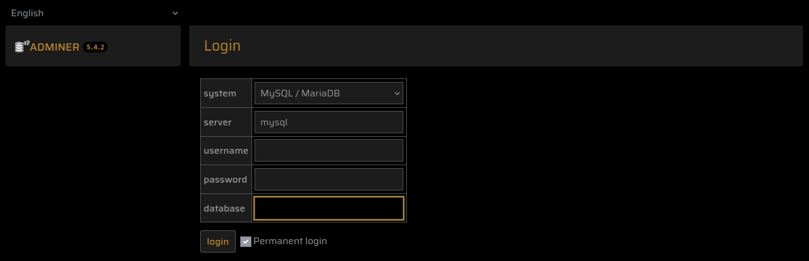
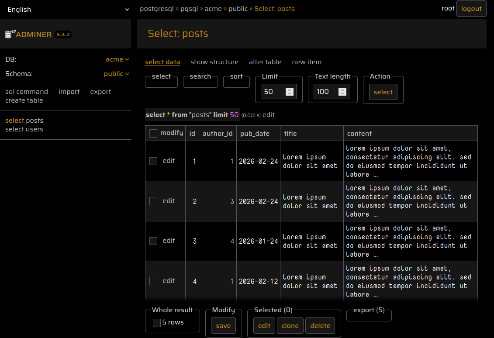
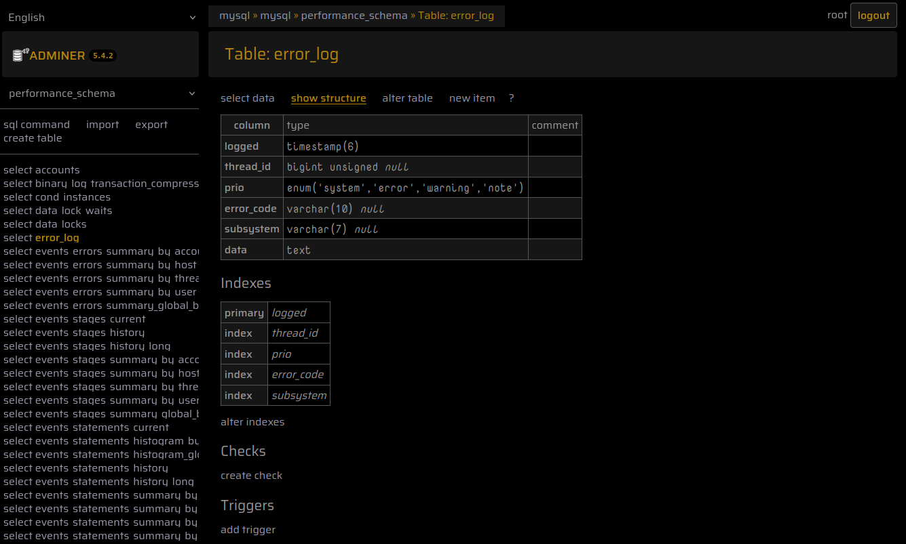
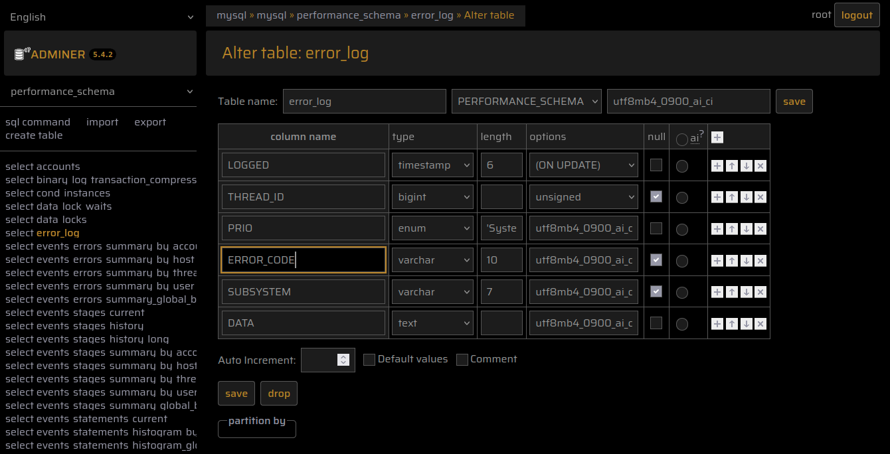
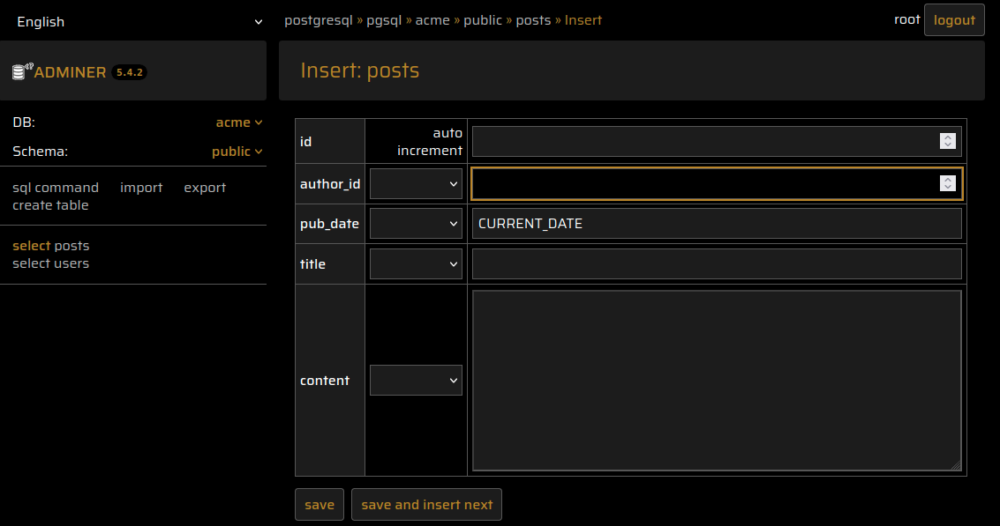

### Let It Snow

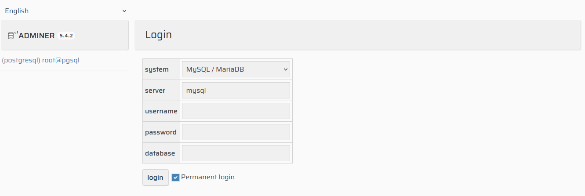
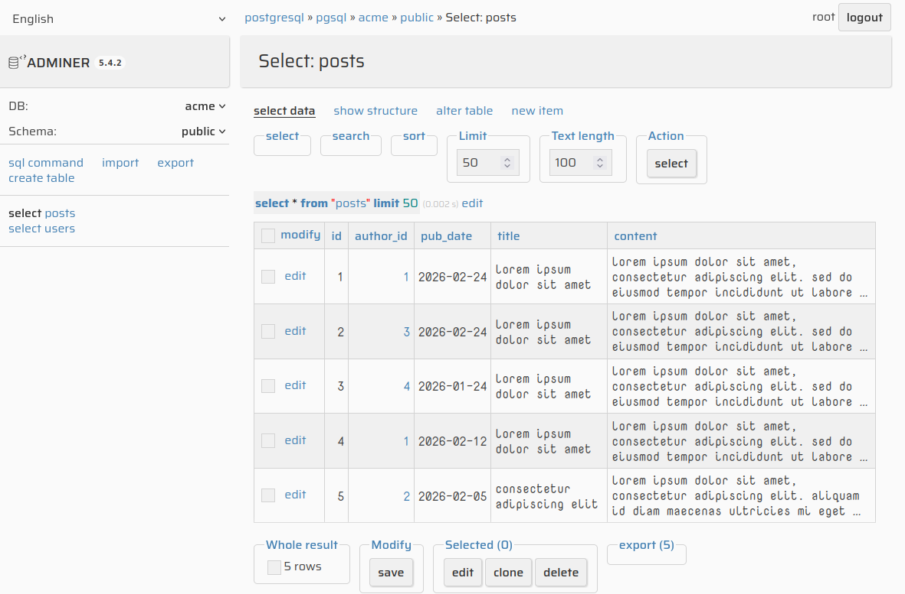
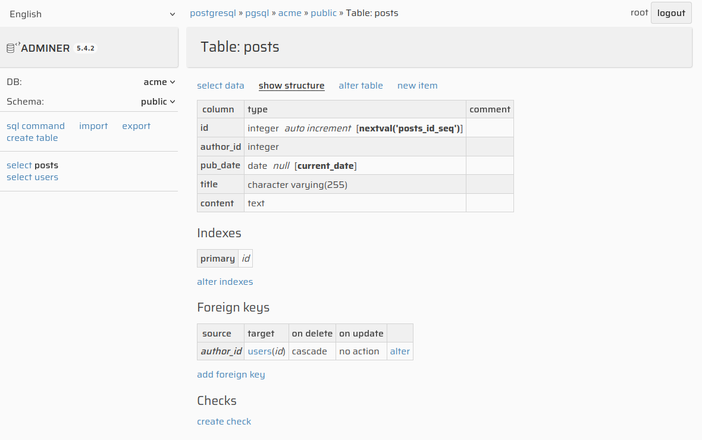
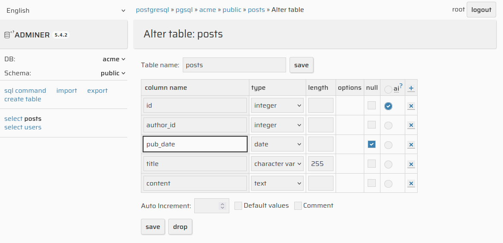
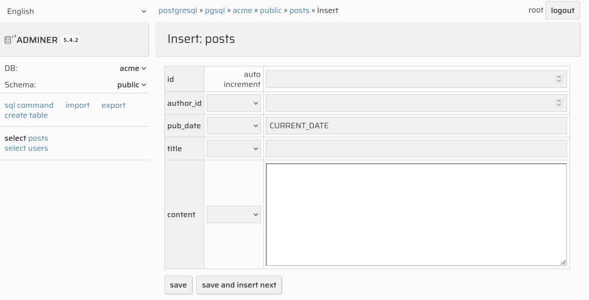

### Purple Rain

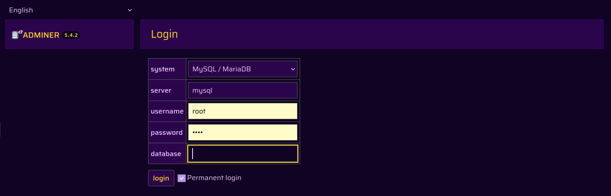
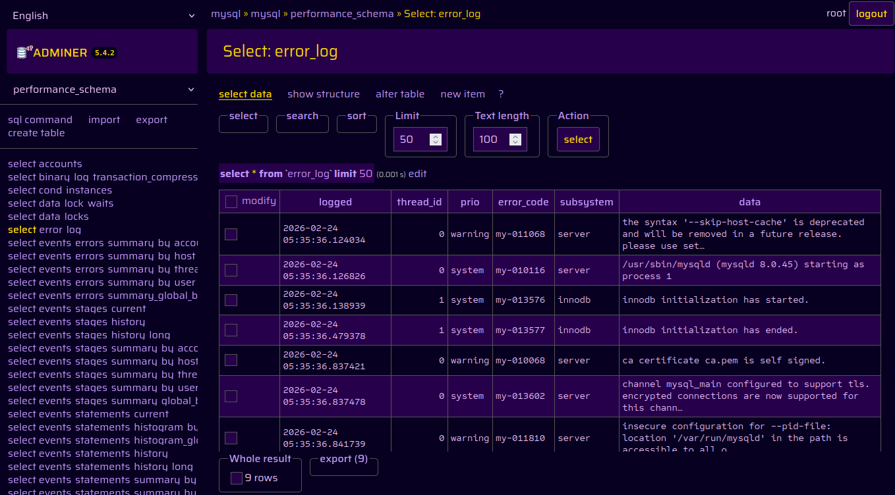
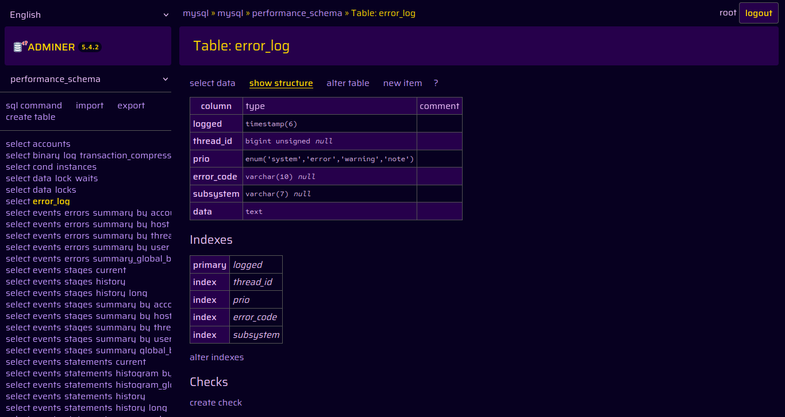
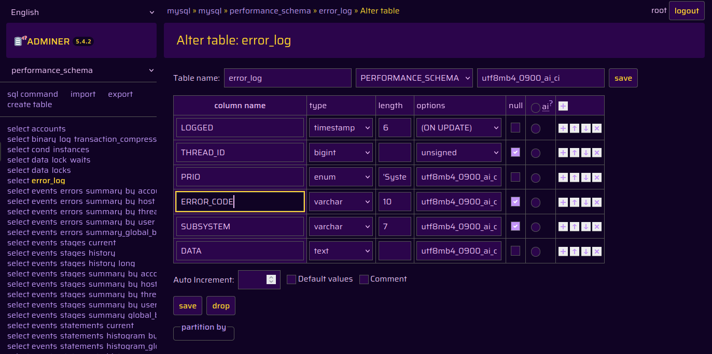
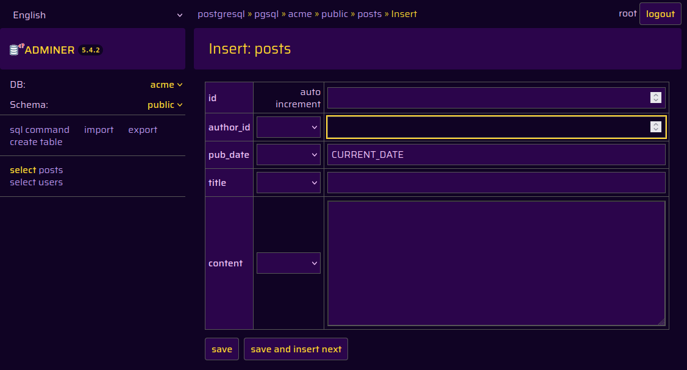

### Tea In The Sahara

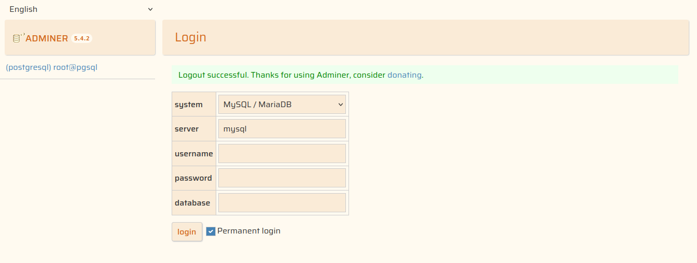
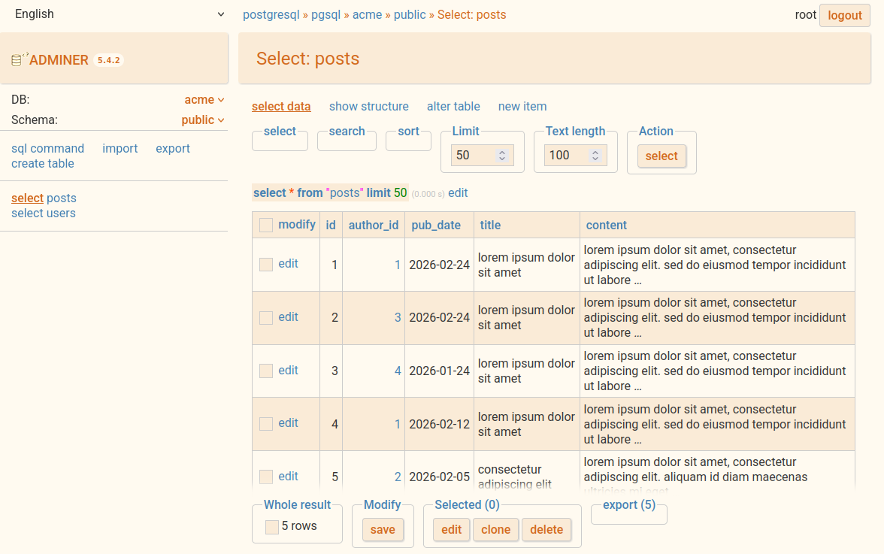
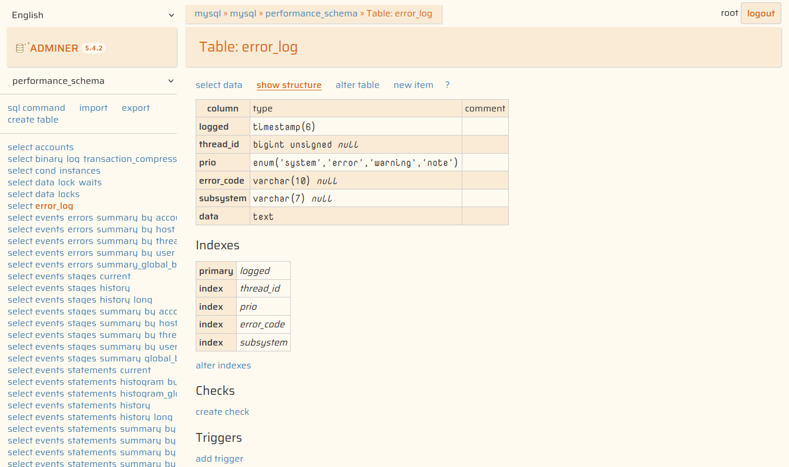


