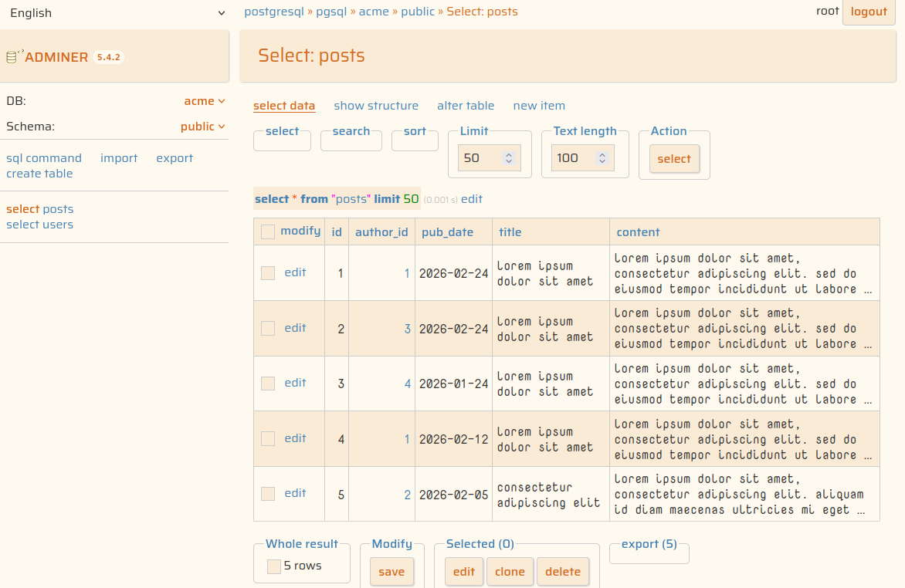
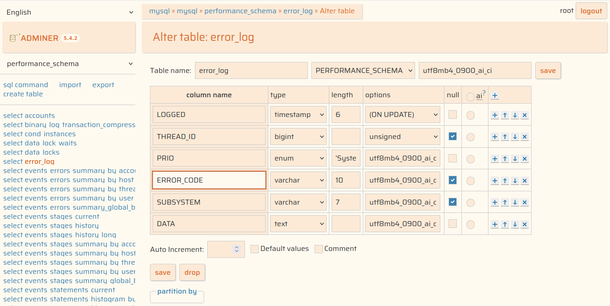
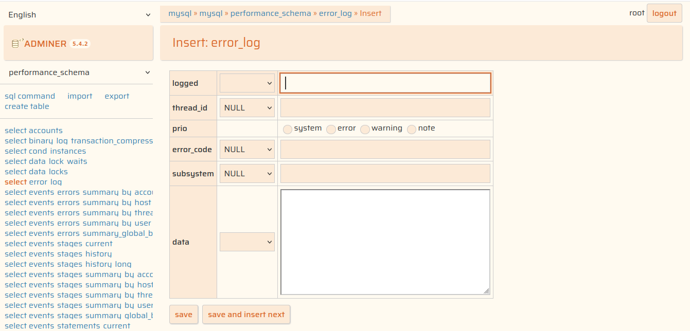

# Adminer DataPlay Themes

A collection of minimalist **Adminer** themes, easily customizable via CSS variables.

Choose from our predefined themes or tweak the colors and typography to match your personal style.

## Main File: `adminer.css`

The core configuration file for the **Adminer** interface. It includes the following features:

### Select Your Color Theme

Available themes:

| Theme                 | File path                                |
| --------------------- | ---------------------------------------- |
| Cream (Light)         | `themes/assets/theme-cream.css`          |
| Let It Snow (Light)   | `themes/assets/theme-let-it-snow.css`    |
| Black is Black (Dark) | `themes/assets/theme-black-is-black.css` |
| Purple Rain (Dark)    | `themes/assets/theme-purple-rain.css`    |

To switch themes, edit `themes/adminer.css`, uncomment the `@import` line for your preferred style, and refresh your browser.

### Typography & Fonts

To customize fonts, edit `themes/assets/fonts.css`. You can load fonts from Google Fonts or any other provider by configuring these **CSS variables**:

| Variable                          | Description                             |
| --------------------------------- | --------------------------------------- |
| `--theme-font-primary`            | Primary UI typeface                     |
| `--theme-font-size-primary`       | Default font size                       |
| `--theme-datatable-font`          | Data table typeface (inherit or custom) |
| `--theme-datatable-font-size`     | Data table font size                    |
| `--theme-datatable-white-space`   | Controls text wrapping in tables        |
| `--theme-datatable-overflow-wrap` | Controls overflow behavior in tables    |

> **Tip:** You can set a specific font (e.g., monospace) for table data or use `inherit` to keep the primary UI font.
>
> By default, **Adminer** applies `white-space: pre;` to data cells, which often makes rows excessively long and forces horizontal scrolling. Use the last two variables to adjust this behavior (see screenshots for examples).

---

## Quick Start with Docker

If you have Docker installed, you can manage the environment using the provided `Makefile`.

```bash
# Start Adminer with Docker
make up

# Stop services
make down

# Restart services
make restart

# Rebuild everything (WARNING: This deletes database volumes)
make rebuild
```

When starting with `make up`, **Adminer** will be available at `http://localhost:8080`. The setup includes two `acme` databases (MySQL and PostgreSQL) pre-loaded with sample tables and test data.

To log in, use the following credentials in the login form:

- **System**: `MySQL/MariaDB` | `PostgreSQL`
- **Server**: `mysql` | `pgsql` (Docker containers)
- **Username**: `root`
- **Password**: `root`
- **Database**: `acme` (or leave blank to select it later)

## Folders Structure

```
.
├── themes/
│   ├── adminer.css
│   └── assets/
│       ├── fonts.css
│       ├── theme-black-is-black.css
│       ├── theme-cream.css
│       ├── theme-let-it-snow.css
│       └── theme-purple-rain.css
├── init/
│   ├── mysql-setup.sql
│   └── pgsql-setup.sql
├── compose.yaml
└── Makefile
```

## Gallery

### Black is Black


### Cream







### Purple Rain


### Let It Snow


